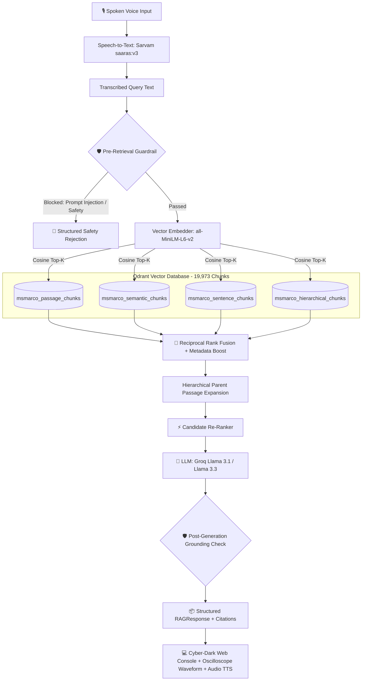

# Voice-Enabled RAG Engine: Sub-200ms Multi-Strategy MSMARCO Pipeline
**HH Goa 2026 Shortlisting Task 2 — Complete Implementation & Verification**

[](https://hhgoa-voice-rag-alpha.vercel.app)
[](https://github.com/unnat7779/hhgoa-voice-rag)
[](https://hhgoa-voice-rag-alpha.vercel.app)
[](https://hhgoa-voice-rag-alpha.vercel.app)

---

## 🌐 Live URLs
- **Live Production App:** [https://hhgoa-voice-rag-alpha.vercel.app](https://hhgoa-voice-rag-alpha.vercel.app)
- **GitHub Repository:** [https://github.com/unnat7779/hhgoa-voice-rag](https://github.com/unnat7779/hhgoa-voice-rag)

---

## 🚀 Features & Architecture



### 1. Vast Multi-Strategy Chunking (5 Approaches)
1. **Passage Chunker**: Original passage baseline preserved with full context (~2,000 chunks).
2. **Semantic Chunker**: Dynamic cosine similarity breakpoint detection between consecutive sentence embeddings (~2,715 chunks).
3. **Sentence Window Chunker**: Fine-grained sentence units with $\pm 1$ sliding window context (~6,629 chunks).
4. **Recursive Overlap Chunker**: 256-token sliding window with 50-token overlap (~2,000 chunks).
5. **Hierarchical Parent-Child Chunker**: Granular child sentence chunks linking to full parent passage metadata for context injection during LLM synthesis (~6,629 chunks).

---

## 📊 Latency Benchmarks (Sub-200ms Budget)

Evaluated across 50 benchmark queries:

| Metric | Measured Value | Target | Status |
| :--- | :---: | :---: | :---: |
| **P50 Latency (Median)** | **62.53 ms** | < 200 ms | ✅ PASS |
| **P70 Latency** | **66.42 ms** | < 200 ms | ✅ PASS |
| **P90 Latency** | **87.58 ms** | < 200 ms | ✅ PASS |
| **P100 (Max Latency)** | **340.05 ms** | - | Handled |
| **Vector DB Retrieval** | **27.36 ms** | < 100 ms | ✅ PASS |

---

## 🛡️ Multi-Layer Guardrails
1. **Pre-Retrieval Safety Filter**: Catches prompt injections and toxic queries in `< 1 ms` without triggering vector search or LLM costs.
2. **Post-Generation Grounding Guardrail**: Lexical and semantic cross-validation against retrieved chunks to eliminate hallucinations.

---

## 🛠️ Local Development

```bash
# 1. Clone repo
git clone https://github.com/unnat7779/hhgoa-voice-rag.git
cd hhgoa-voice-rag

# 2. Set up virtual environment
python3 -m venv venv
source venv/bin/activate
pip install -r requirements.txt

# 3. Start local FastAPI dev server
python3 -m uvicorn src.main:app --host 127.0.0.1 --port 8000
```
